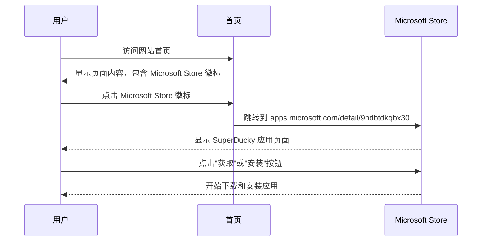
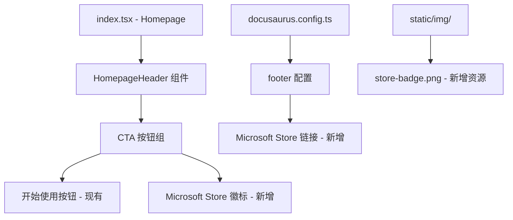

# Change: 添加可以从 Windows Store 安装的徽标

**Status:** ExecutionCompleted

## Why

SuperDucky 已上架 Microsoft Store，用户可以通过 Windows 应用商店直接安装应用。当前网站缺少 Microsoft Store 的安装徽标，用户无法直观地看到该项目可以从官方应用商店获取和安装，影响用户的下载渠道发现和项目品牌展示。

## What Changes

- 在首页 Hero 区域添加 Microsoft Store 安装徽标
- 在网站页脚添加 Microsoft Store 下载链接
- 添加 Microsoft Store 徽章图片资源到 `static/img/` 目录
- 在 TypeScript 组件中使用正确的 `require('@site/static/img/...')` 语法引用图片
- 更新 `landing-page` 规格以包含 Microsoft Store 徽标显示要求

## UI 设计变更

### 首页 Hero 区域 - Microsoft Store 徽标位置

```
┌─────────────────────────────────────────────────────────────────────┐
│                        SuperDucky                                    │
│                 The Ultimate Game Mod Manager                        │
│                                                                      │
│     ┌─────────────────┐    ┌─────────────────┐                      │
│     │   开始使用      │    │   [新增]        │                      │
│     │                 │    │  Microsoft Store │                      │
│     │                 │    │    徽标         │                      │
│     └─────────────────┘    └─────────────────┘                      │
│                                                                      │
│     ┌─────────────────────────────────────────────────────────┐     │
│     │  Steam 创意工坊集成 | ∞ 配置文件 | 100% 免费开源         │     │
│     └─────────────────────────────────────────────────────────┘     │
└─────────────────────────────────────────────────────────────────────┘
```

### 用户交互流程



### 页脚 - Microsoft Store 链接位置

```
┌─────────────────────────────────────────────────────────────────────┐
│  文档                       │  社区                     │ 更多       │
│  - 安装指南                  │  - GitHub                 │ - Microsoft│
│                             │  - Issue 追踪             │   Store    │
└─────────────────────────────────────────────────────────────────────┘
```

## 代码流程变更

### 组件架构



### 代码变更清单

| 文件路径 | 变更类型 | 变更原因 | 影响范围 |
|---------|---------|---------|---------|
| `static/img/store-badge.png` | 新增 | Microsoft Store 徽章图片资源 | 静态资源 |
| `src/pages/index.tsx` | 修改 | 在 Hero 区域添加 Microsoft Store 徽标链接 | 首页 UI |
| `docusaurus.config.ts` | 修改 | 在页脚添加 Microsoft Store 链接 | 网站配置 |
| `openspec/changes/microsoft-store-badge-integration/specs/landing-page/spec.md` | 新增 | 添加 Microsoft Store 徽标显示需求 | landing-page 规格增量 |

### 详细变更 - index.tsx

| 组件/方法 | 变更前 | 变更后 | 变更原因 |
|----------|-------|-------|---------|
| buttons div | 包含"开始使用"和"立即下载"两个按钮 | 添加第三个 Microsoft Store 徽标按钮 | 提供官方应用商店入口 |
| Link 组件 | 使用 GitHub releases 链接 | 新增 Microsoft Store 链接 (https://apps.microsoft.com/store/detail/9ndbtdkqbx30) | 引导用户到应用商店 |

### 详细变更 - docusaurus.config.ts

| 配置项 | 变更类型 | 具体变更 | 变更原因 |
|--------|---------|---------|---------|
| footer.links | 新增 | 添加新的链接分组"更多"，包含 Microsoft Store 链接 | 在页脚提供应用商店入口 |

## Impact

- **Affected specs:** `landing-page` (添加 Microsoft Store 徽标显示要求)
- **Affected code:**
  - `src/pages/index.tsx:75-94` - Hero 区域按钮组
  - `docusaurus.config.ts:106-133` - 页脚配置
  - `static/img/` - 新增徽标图片
- **用户体验:** 用户可以直观地看到 Microsoft Store 安装入口，增强对官方应用商店渠道的认知
- **品牌展示:** 展示项目已通过 Microsoft Store 审核，提升项目专业性和可信度
- **技术实现:** 遵循项目的 `require('@site/static/...')` 图片引用规范，确保 `baseUrl` 兼容性
