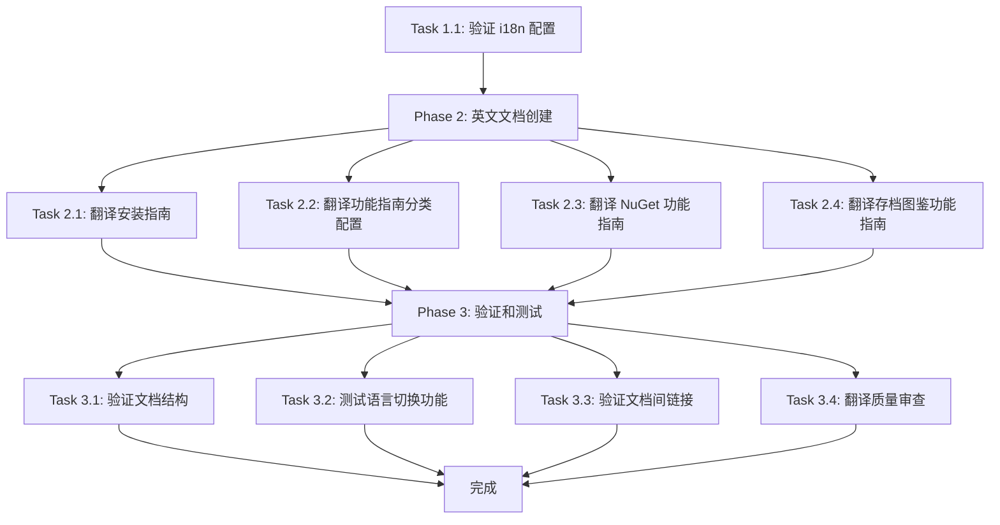

# Tasks: English Documentation i18n Completion

## Overview

本文档列出实现"添加英文文档"变更所需的所有任务。任务按照依赖关系和执行顺序组织。

## Task List

### Phase 1: 准备工作

#### Task 1.1: 验证 i18n 配置
**Priority:** High
**Effort:** Low

**Description:**
确认 Docusaurus i18n 配置正确，英文语言环境已启用。

**Steps:**
1. 检查 `docusaurus.config.js` 中的 i18n 配置
2. 确认 `en` 语言已配置为 `zh-Hans` 的辅助语言
3. 验证 `i18n/en` 目录结构存在

**Acceptance Criteria:**
- `docusaurus.config.js` 包含正确的 i18n 配置
- `i18n/en/docusaurus-plugin-content-docs/current/` 目录存在

---

### Phase 2: 英文文档创建

#### Task 2.1: 翻译安装指南
**Priority:** High
**Effort:** Medium

**Description:**
为 `docs/installation.md` 创建英文翻译版本。

**Source File:** `docs/installation.md`
**Target File:** `i18n/en/docusaurus-plugin-content-docs/current/installation.md`

**Translation Requirements:**
- 保持 sidebar_position: 1
- 标题: Installation Guide
- 术语对照：
  - 系统要求 → System Requirements
  - 下载 → Download
  - Windows/macOS/Linux → 保持不变
  - 安装版本 → Installer Version
  - 免安装版本 → Portable Version
  - 验证安装 → Verify Installation
  - SHA256 校验 → SHA256 Verification

**Steps:**
1. 阅读中文原文档
2. 创建英文翻译文件
3. 保持 Markdown 格式和 frontmatter
4. 验证翻译质量和术语一致性

**Acceptance Criteria:**
- 英文文件存在于 `i18n/en/docusaurus-plugin-content-docs/current/installation.md`
- 翻译准确、术语一致
- Markdown 格式正确
- Frontmatter 元数据完整

---

#### Task 2.2: 翻译功能指南分类配置
**Priority:** High
**Effort:** Low

**Description:**
为 `docs/feature-guides/_category_.json` 创建英文版本。

**Source File:** `docs/feature-guides/_category_.json`
**Target File:** `i18n/en/docusaurus-plugin-content-docs/current/feature-guides/_category_.json`

**Translation Requirements:**
- label: "功能指南" → "Feature Guides"
- description 翻译: "SuperDucky 各项功能的启用和使用指南" → "Guides for enabling and using SuperDucky features"

**Steps:**
1. 读取中文配置文件
2. 创建英文配置文件
3. 验证 JSON 格式正确

**Acceptance Criteria:**
- 英文配置文件存在
- JSON 格式有效
- label 和 description 翻译准确

---

#### Task 2.3: 翻译启用 NuGet 功能指南
**Priority:** High
**Effort:** Medium

**Description:**
为 `docs/feature-guides/enable-nuget.md` 创建英文翻译版本。

**Source File:** `docs/feature-guides/enable-nuget.md`
**Target File:** `i18n/en/docusaurus-plugin-content-docs/current/feature-guides/enable-nuget.md`

**Translation Requirements:**
- 保持 sidebar_position: 1
- 标题: Enable NuGet Feature
- 术语对照：
  - 功能简介 → Feature Overview
  - 启用 NuGet 功能 → Enable NuGet Feature
  - 使用说明 → Usage Instructions
  - 常见问题 → FAQ

**Steps:**
1. 阅读中文原文档
2. 创建英文翻译文件
3. 保持图片引用路径不变
4. 验证翻译质量

**Acceptance Criteria:**
- 英文文件存在且翻译准确
- 图片路径保持不变
- Markdown 格式正确

---

#### Task 2.4: 翻译启用存档图鉴功能指南
**Priority:** High
**Effort:** Medium

**Description:**
为 `docs/feature-guides/enable-save-gallery.md` 创建英文翻译版本。

**Source File:** `docs/feature-guides/enable-save-gallery.md`
**Target File:** `i18n/en/docusaurus-plugin-content-docs/current/feature-guides/enable-save-gallery.md`

**Translation Requirements:**
- 保持 sidebar_position: 2
- 标题: Enable Save Gallery Feature
- 术语对照：
  - 功能简介 → Feature Overview
  - 前置要求 → Prerequisites
  - 安装依赖并启用 → Install Dependencies and Enable
  - 图鉴预览 → Gallery Preview
  - 物品对比 → Item Comparison
  - 简单物品/复杂物品/Mod 物品 → Simple Item/Complex Item/Mod Item
  - 使用提示 → Usage Tips

**Steps:**
1. 阅读中文原文档
2. 创建英文翻译文件
3. 保持图片引用路径不变
4. 确保警告和信息块（callouts）翻译准确
5. 验证翻译质量

**Acceptance Criteria:**
- 英文文件存在且翻译准确
- 图片路径保持不变
- Callout 块（:::info, :::warning）格式正确
- Markdown 格式正确

---

### Phase 3: 验证和测试

#### Task 3.1: 验证文档结构
**Priority:** High
**Effort:** Low

**Description:**
验证所有英文明档文件已正确创建。

**Steps:**
1. 检查 `i18n/en/docusaurus-plugin-content-docs/current/` 目录结构
2. 确认所有必需的英文文件存在
3. 验证文件命名正确

**Acceptance Criteria:**
- `installation.md` 存在
- `feature-guides/_category_.json` 存在
- `feature-guides/enable-nuget.md` 存在
- `feature-guides/enable-save-gallery.md` 存在
- `feature-guides/mod-management.md` 已存在（无需变更）

---

#### Task 3.2: 测试语言切换功能
**Priority:** High
**Effort:** Medium

**Description:**
在本地测试中英文语言切换功能，确保所有页面都能正确显示对应语言内容。

**Steps:**
1. 启动 Docusaurus 开发服务器: `npm run start`
2. 在浏览器中打开文档站点
3. 切换到英文语言
4. 逐个访问所有文档页面
5. 验证内容显示为英文
6. 切换回中文语言
7. 验证内容显示为中文

**Acceptance Criteria:**
- 语言切换功能正常
- 所有英文页面正确显示
- 所有中文页面正确显示
- 无未翻译内容

---

#### Task 3.3: 验证文档间链接
**Priority:** Medium
**Effort:** Low

**Description:**
验证文档之间的相互链接在英文环境下正常工作。

**Steps:**
1. 在英文环境下浏览文档
2. 点击所有文档内部链接
3. 验证链接指向正确的页面
4. 检查是否有 404 错误

**Acceptance Criteria:**
- 所有文档内链接正常工作
- 无 404 错误
- 锚点链接正确跳转

---

#### Task 3.4: 翻译质量审查
**Priority:** Medium
**Effort:** Low

**Description:**
审查英文翻译的质量和一致性。

**Steps:**
1. 检查术语翻译一致性
2. 验证专业术语（mod、profile、workshop 等）使用统一
3. 检查语法和拼写
4. 确保翻译自然流畅

**Acceptance Criteria:**
- 术语使用一致
- 无明显语法或拼写错误
- 翻译表达自然

---

## 文件变更清单

| 文件路径 | 变更类型 | 变更原因 |
|---------|---------|---------|
| `i18n/en/docusaurus-plugin-content-docs/current/installation.md` | 新增 | 安装指南英文翻译 |
| `i18n/en/docusaurus-plugin-content-docs/current/feature-guides/_category_.json` | 新增 | 功能指南分类配置英文版 |
| `i18n/en/docusaurus-plugin-content-docs/current/feature-guides/enable-nuget.md` | 新增 | NuGet 功能指南英文翻译 |
| `i18n/en/docusaurus-plugin-content-docs/current/feature-guides/enable-save-gallery.md` | 新增 | 存档图鉴功能指南英文翻译 |

**Note**: `i18n/en/docusaurus-plugin-content-docs/current/feature-guides/mod-management.md` 已存在，无需变更。

## 执行顺序

## 术语对照表

| 中文术语 | 英文翻译 | 备注 |
|---------|---------|------|
| 模组 | mod | 保持小写 |
| 配置文件 | profile | 保持英文 |
| 创意工坊 | Workshop | Steam Workshop |
| 启用/禁用 | Enable/Disable | 动词形式 |
| 安装 | Install | - |
| 依赖 | dependency | 复数 dependencies |
| 功能指南 | Feature Guides | - |
| 安装指南 | Installation Guide | - |
| 存档图鉴 | Save Gallery | - |
| NuGet 市场 | NuGet Marketplace | - |
| 物品 | item | - |
| 简单物品/复杂物品 | Simple Item/Complex Item | - |
| 预览 | preview | - |
| 健康检查 | Health Check | - |
| 分组 | group | - |
| 筛选 | filter | - |

## 完成标准

- [x] 所有英文文档文件已创建
- [x] 翻译质量通过审查
- [x] 语言切换功能正常工作
- [x] 所有文档链接有效
- [x] 术语使用一致
