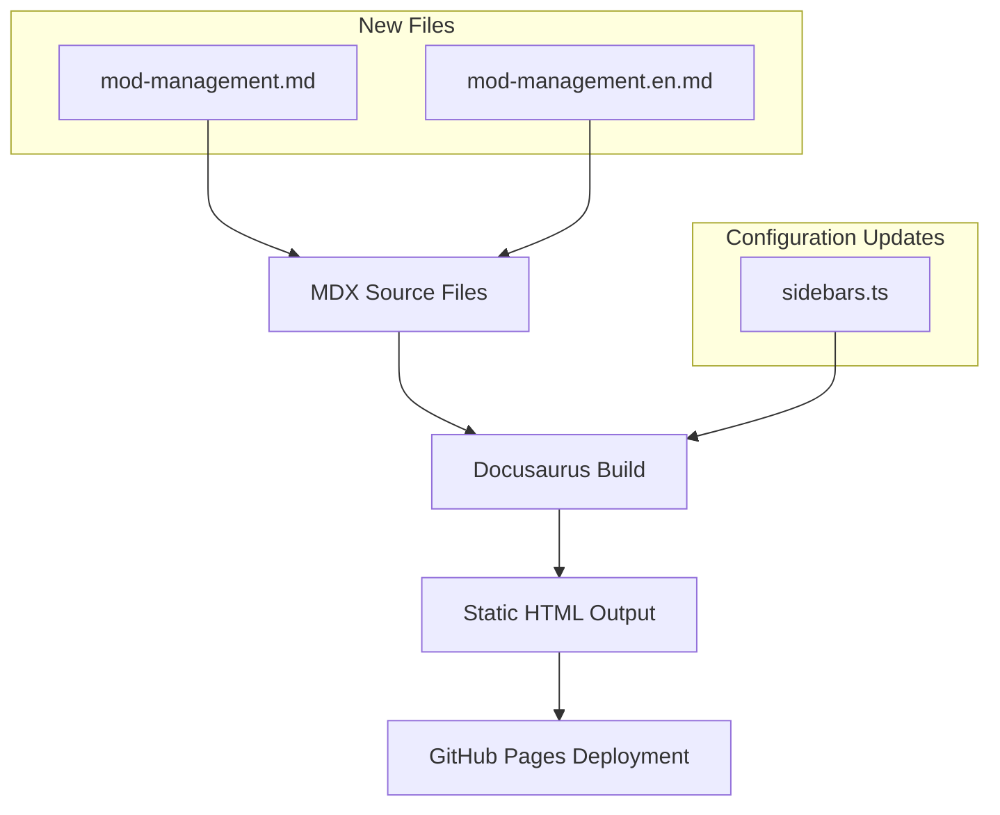
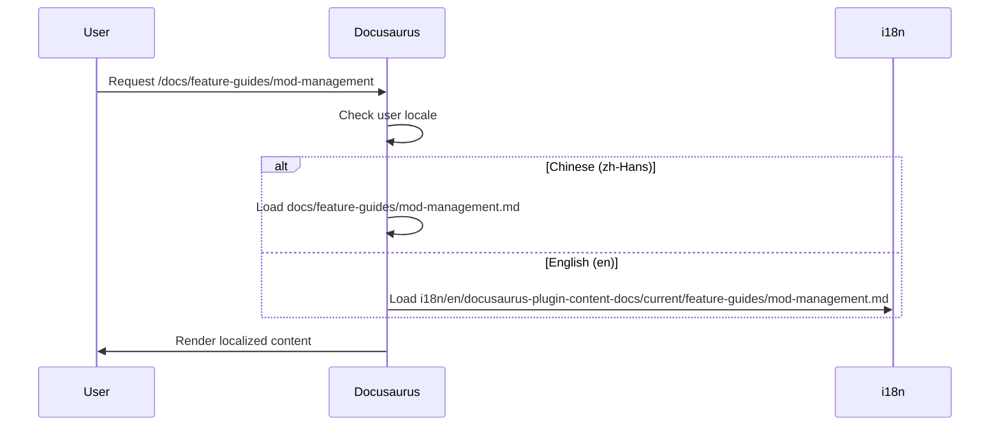

# Change: Add Mod Management Feature Guide

## Why

SuperDucky is a game mod manager for Windows, but the documentation currently lacks a comprehensive guide for mod management functionality. Users cannot learn how to browse installed mods, manage mod details, use Steam Workshop integration, or perform mod operations like enabling/disabling and updating.

## What Changes

- Add new feature guide document `docs/feature-guides/mod-management.md` with comprehensive mod management instructions
- Add new feature guide document `docs/feature-guides/mod-management.en.md` for English translation
- Update `sidebars.ts` to include the new mod-management guide in the feature-guides category
- Add new feature guide document `i18n/en/docusaurus-plugin-content-docs/current/feature-guides/mod-management.md` as alternative bilingual structure
- Add supporting screenshots to `static/img/screenshots/mod-management/` directory (optional but recommended)

## UI Design Changes

### New Documentation Page Structure

The mod management guide will follow the established pattern from existing feature guides:

```
---
title: 模组管理功能介绍
sidebar_position: 3
---

模组管理是 SuperDucky 的核心功能，本文档将详细介绍如何使用模组管理功能。

## 功能简介

[Overview of mod management capabilities]

## 模组列表视图

[List view layout, display options, filtering and sorting]

## 模组详情面板

[Mod metadata, dependencies, file list]

## Steam Workshop 集成

[Browse Workshop, subscribe and auto-download, update checks]

## 模组操作

[Enable/disable, update, batch operations]
```

### Navigation Structure

```
mainSidebar
├── installation
└── 功能指南 (Feature Guides)
    ├── feature-guides/enable-nuget
    ├── feature-guides/enable-save-gallery
    └── feature-guides/mod-management (NEW)
```

## Code Flow Changes

### Documentation Build Flow



### Bilingual Content Flow



## Impact

- **Affected specs:** `docs` (new requirements for mod management documentation)
- **Affected code:**
  - `sidebars.ts` - add mod-management to feature-guides category
  - `docs/feature-guides/mod-management.md` - new file (Chinese)
  - `docs/feature-guides/mod-management.en.md` - new file (English) OR
  - `i18n/en/docusaurus-plugin-content-docs/current/feature-guides/mod-management.md` - new file (English, following i18n pattern)
  - `static/img/screenshots/mod-management/` - optional new directory for screenshots

## Success Criteria

1. New mod-management guide appears in sidebar under "功能指南" category
2. Guide includes all required sections (list view, details panel, Workshop integration, mod operations)
3. Bilingual content is provided (Chinese primary, English translation)
4. All internal links work correctly
5. Screenshots load from correct paths if provided
6. `yarn build` completes without errors
7. No broken links in the new documentation

## Notes

- The existing DML source code at `/home/newbe36524/repos/newbe36524/DML/client/src/renderer` should be referenced for accurate feature descriptions
- Follow the established documentation pattern from `enable-nuget.md` and `enable-save-gallery.md`
- Use `sidebar_position: 3` to place after existing feature guides
- Maintain consistent tone and formatting with existing documentation
